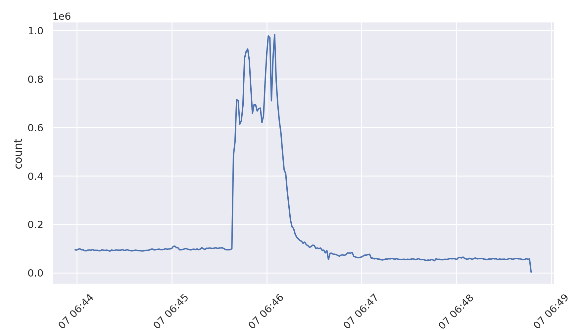

An Example Case Study
=====================

The best way of showing how `traffic-taffy` can be used to analyze
large datasets, we will walk through an example dataset to analyze its
contents.

The Dataset
-----------

The dataset under study will be the [B_Root_Anomaly-20190907]_ dataset
that contains traffic from a DDoS attack on the b.root-servers.net DNS
root server, published by the [ANTLab]_ (of which the author is
associated with).  Note that this dataset contains a very large spike
of traffic that is not particularly difficult for a human to
necessarily perform this analysis by hand.  Thus, it serves as a good
example so that the data can be analyzed in multiple fashions in order
to come up with hopefully similar conclusions.  .

The README file's description of this event is as follows:

Parameter   Value
=========== ============================
Duration    06:45:19 UTC to 06:46:53 UTC
Sources     Spoofed (Randomized)
Query name  No fixed query name
Packet size 554 bytes requests

Using this informationn we select the following files from the dataset
to study from the LAX anycast instance and that directly surround the
event in question.  Thus, we will use just these files, which we'll
just call **FILES** when using all of them in the rest of this
document.

.. [B_Root_Anomaly-20190907] https://comunda.isi.edu/artifact/view/1437

.. [ANTLab] https://ant.isi.edu/

* 20190907-064359-01587810.lax.pcap.xz
* 20190907-064519-01587811.lax.pcap.xz
* 20190907-064545-01587812.lax.pcap.xz
* 20190907-064550-01587813.lax.pcap.xz
* 20190907-064557-01587814.lax.pcap.xz
* 20190907-064603-01587815.lax.pcap.xz
* 20190907-064610-01587816.lax.pcap.xz
* 20190907-064653-01587817.lax.pcap.xz

Producing Cache Files
---------------------

Using a *level 10 dissection* analyzer, with *1 second bin time* we
can produce a graph of the total traffic to get a feel for the size of
the event.  use *-C* to enable caching of the results (note: this
first run will take a while to complete).  We use the special
identifier *__TOTAL__*  to select just the total number of packets to
create this graph.

::

   taffy-graph -C -b 1 -m __TOTAL__ -o total-traffic.png *.pcap.xz

Which produces the following graph:

Starting with a high-level analysis
===================================

We will start by comparing all of the pcap files against each other to
determine what is different between them.  We use the `taffy-compare`
utility todo this, selecting some parameters to limit the display to
just those that are likely big jumps.

:: taffy-compare -C -c 10000 -x 5 -t 10 *.pcap.xz

The full output can be found in this file:
`<case-study-output/initial-compare.txt>`_ , but we highly some of the
output using screenshots of `taffy-compare`'s colorized terminal
output.

The output is functionally a 7 column table that depicts the following
items per packet field listed, which each field in question being
listed as a header above the table section:

* The value of the particular field
* The count of this value in the "left" PCAP file
* The count of this value in the "right" PCAP file
* The delta between the left and right counts
* The percentage of this value in all the values for this packet field
  in the "left" PCAP file
* The percentage of this value in all the values for this packet field
  in the "right" PCAP file
* The delta between the left and right percentages

We look specifically at the output for the file that exists just
before the start of the attack (20190907-064359-01587810.lax.pcap.xz)
vs the one just within the attack
(20190907-064519-01587811.lax.pcap.xz).  Looking at this set of
differences, we can make the following observations:

There is an increase in the Cache Disabled DNS bit
^^^^^^^^^^^^^^^^^^^^^^^^^^^^^^^^^^^^^^^^^^^^^^^^^^

Here we see that there was a decent increase in DNS requests that
set the cache disable bit to 0 (there was a 14.86% increase in packets
in the second file for DNS requests where the CD bit was a value of
0).

There is an increase in unusual DNS operation codes
^^^^^^^^^^^^^^^^^^^^^^^^^^^^^^^^^^^^^^^^^^^^^^^^^^^

In the right (in-attack) file, there was the sudden emergence of
unusual DNS request types.  This shows there was a large number of
opcodes 7, 8, 14, 9, and 15 with more than 200k packets seen per each
compared to the "left" file in which none of these op codes were seen.

These opcodes are indeed highly unusual, as can be seen from the [IANA
opcodes] that lists what these opcode values mean.  Specifically, they
are all in the unassigned range which indicates that either they were
likely randomly chosen in the attack data or could even be an attempt
to see if the server's code base could properly handle different
values.

.. [IANA opcode]  https://www.iana.org/assignments/dns-parameters/dns-parameters.xhtml#dns-parameters-5

A significant increase in queries for example.com
^^^^^^^^^^^^^^^^^^^^^^^^^^^^^^^^^^^^^^^^^^^^^^^^^

This shows an interesting increase in queries for www.example.com,
which may be from the attacker attempting to perform a real request
for determining whether or not the server is still operating properly
and returning valid responses.

